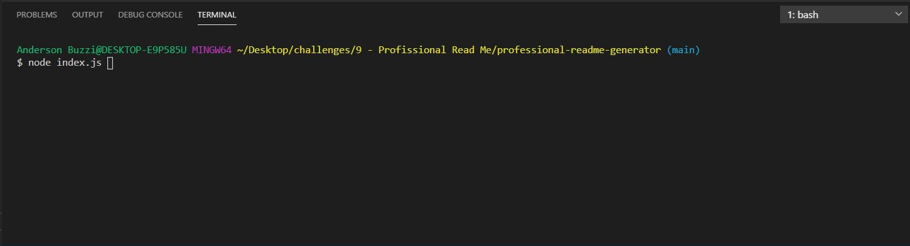
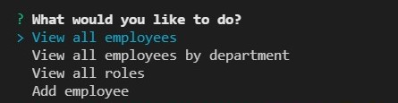
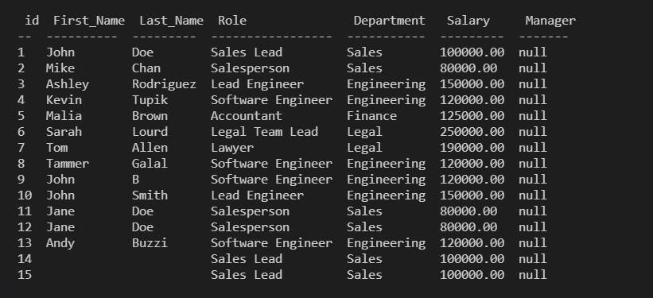

# Team Profile Generator

## Description

This application has been created to track employee information, where the main goal is to help companies to manage their employees. In this application, the user is presented with few options on the terminal that permits them to view information as needed. The options are the following:

What would you like to do?

- View all employees;
- View all employees by department;
- View all roles;
- Add employee

  - What is the new employee's first name;
  - What is the new employee's last name?;
  - Select a role for the employee;

  [Walkthrough video of the Team Profile Generator](https://youtu.be/Dq-nUB3gutM)

## Table of Contents

- [Installation](#installation)
- [Usage](#usage)
- [License](#license)
- [Questions](#questions)

## Installation

This application has been created using node.js. To run this application please make sure to have node.js installed in your computer and run the following command in your terminal.

`<npm install inquirer>`

## Usage

This application has been made to help companies to uptimize their time and have their employees information shown in a simple, organized and easy way with all the information needed just by selecting a few options.

Below screenshots of some of the features for reference.

- First step: Enter node index.js to start application;

  

- Questions will be displayed in the terminal;

  

- After answering all the questions a team profile file will be generated containing your team information.

  

## License

This project is covered under MIT license.

[Click here to learn more about this license](https://opensource.org/licenses/MIT)

## Questions

Please feel free to contact me if you have any question or need any further information.

- [GitHub Profile](andybuzzi.github.com)

- [Email Address](andy@gmail.com)
